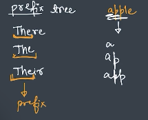
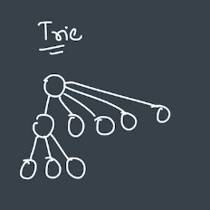
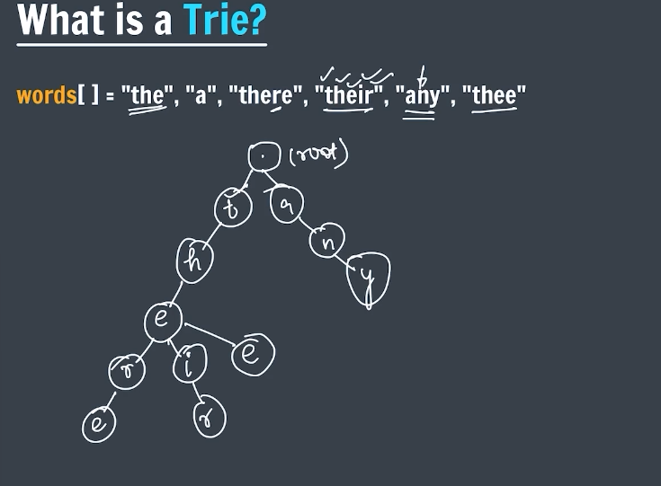
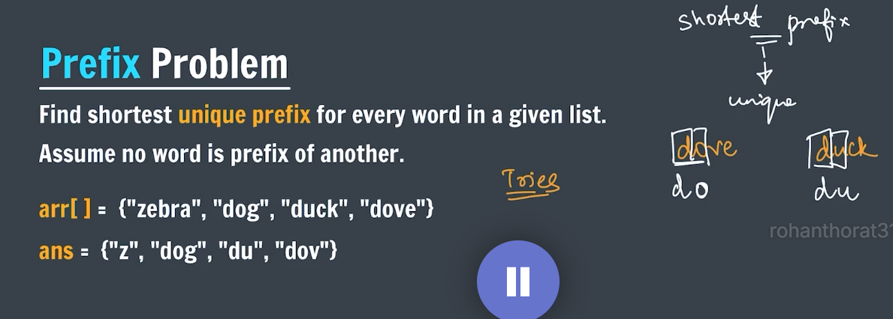

```Trie``` -  Like tree & used to solve "Str" Rel questions 

Aniamtion : https://1e1e3c11-5a6f-4057-b22a-aa66ec1a5243-00-3qs9xodjtsdga.picard.replit.dev/trie-walkthrough/

also called 

1.```Prefix tree``` -> "apple" "app"  same prefix ko tree me ek hi baar store karne ka. [ Avoid repeatation of common words]


2.Retrieval tree -> to get data

3.Digital search trees

 What is Tire?   

 it is a K-ary tree [ having k childs]     {B tree me 2}
 

 used more space but gives good TC  [ bcz bohot sare node same level pr aate and height kam hoti ]

 creation 

 


``` can be asked directly ```

 *Insert : O(L)  len of largest word

 **2.Prefix problem [ google,micro]
 


Animation : https://1e1e3c11-5a6f-4057-b22a-aa66ec1a5243-00-3qs9xodjtsdga.picard.replit.dev/trie-prefix-walkthrough/


 *** 3.Count unique substrings
                            ✅
 1. unique substring = all prefixs of all suffix == all suffix of all prefix
 2. Trie stores unique prefix of any string and unique prefix = count of nodes of Trie

 app: find all suffix -> create Tire and insert -> count nodes of Trie [ = unique prefix = unique substrings]